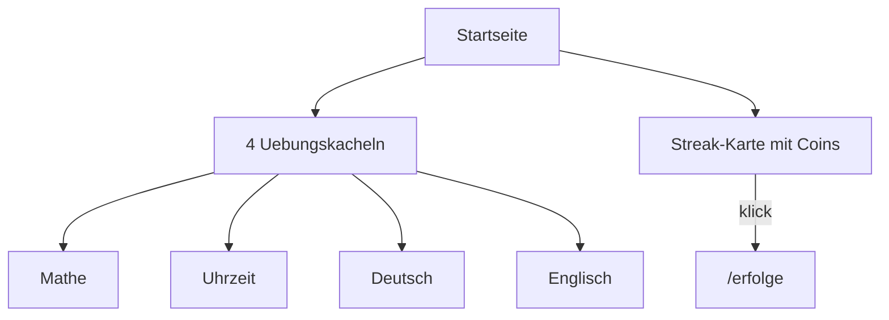

# Englisch-Vokabeltrainer (v1)

EN→DE translation practice for Grundschule Klasse 3: see and hear an English word, type the German meaning. Configurable lists like the Deutsch trainer.

## Product decisions

- **Placement:** Own home tile „Englisch“ as the **4th practice tile** (Mathe, Uhrzeit, Deutsch, Englisch)
- **Home cleanup:** Remove the Erfolge category tile; fold Erfolge into the existing streak card (same theme: progress / rewards)
- **Exercise:** Show + TTS English word (`en-GB`); child types German translation
- **Data:** Admin-configurable word pairs (no hardcoded curriculum)
- **Stacks:** Thematic lists (~8–15 pairs), assignable per user; reuse weight-based session logic
- **Context:** Optional short `context_en` line (read-only); TTS speaks the single English word only
- **Out of v1:** Hangman, images, DE→EN toggle, Leitner UI, Übungsplan block, Sprachen-Hub

## Home layout

Keep exactly **four practice tiles**. Do not add a fifth peer card.

| Before | After |
|---|---|
| Mathe · Uhrzeit · Deutsch · **Erfolge** | Mathe · Uhrzeit · Deutsch · **Englisch** |
| Streak card below (display only) | Streak card = Streak + Coins + entry to `/erfolge` |

### Streak + Erfolge merge

In [`streak-display`](../src/app/components/streak-display/streak-display.component.html) (used on home):

- Keep current streak / milestone UI
- Add coins balance (from `CoinsService`, same as former Erfolge tile footer)
- Make the card navigate to `/erfolge` (whole card as `routerLink`, or clear CTA „Erfolge“)
- Accessible label e.g. „Streak und Erfolge“
- Route `/erfolge` unchanged (tabs, Spiele, Badges)

Remove Erfolge `<a class="category-card erfolge-card">` from [`category-home.html`](../src/app/components/category-home/category-home.html); drop unused `.erfolge-card` styles if unused elsewhere.

## Exercise flow

1. Display `prompt_en` (and optional `context_en` underneath)
2. Auto-play / replay TTS for `prompt_en`
3. Child types German answer via letter keypad
4. Compare trim + case-insensitive to `answer_de`
5. Feedback + weight update (correct −1, wrong +2); rebuild queue when exhausted

## Routes / UI (German labels)

| Path | Purpose |
|---|---|
| `/englisch` | Category overview, daily stats + goal |
| `/englisch/uebung` | Translation exercise |
| `/englisch/verwalten` | Lists, pairs CRUD, user assignment |

Home: Englisch tile next to Deutsch; Erfolge only via streak card.

## Data model

Extend vocab schema (keep existing Deutsch single-field `word` lists working):

- Ensure `vocab_languages` has Englisch (`speech_lang` e.g. `en-GB`)
- `vocab_lists.language_id` required for filtering
- `vocab_list_words`: add `prompt_en`, `answer_de`, optional `context_en`
  - Migration strategy: existing Deutsch rows keep `word`; English lists use the pair columns (or migrate `word` → `prompt_en` only for EN language)
- Assignments + `vocab_word_progress` unchanged (keyed by word id)

Admin mirrors Deutsch management: create/rename/delete lists; add/edit/delete pairs; assign to users.

## Stats / goals

- Exercise type: `englisch-uebersetzung`
- Daily goal: `englisch_daily_goal` on `daily_stats` (separate from Deutsch/`vocab_daily_goal`)
- Aggregate on home/overview like `deutschCorrectCount` → `englischCorrectCount`
- Badges/Erfolge: entry remains via streak card; no new Erfolge home tile

## Implementation checklist

- [x] SQL migration: English language seed, word-pair columns, `englisch_daily_goal`
- [x] Models + Supabase CRUD for EN lists/pairs (language filter)
- [x] Vocab/session service support for EN pairs + TTS lang
- [x] Home: replace Erfolge tile with Englisch; routes `/englisch`, `/englisch/uebung`, `/englisch/verwalten`
- [x] Streak card: coins + link to `/erfolge`; remove Erfolge category card + styles
- [x] Category overview (stats + goal editor)
- [x] Translation exercise component (show/hear EN, type DE)
- [x] Management UI for pairs + assignments (Deutsch-admin parity)
- [x] StatsService: englisch counts + daily goal + coin bonus hook if applicable
- [x] E2E: home → Englisch → Übung/Verwalten; home → Erfolge via streak card (`e2e/navigation.spec.ts`)
- [x] Browser-test locally (restart `start:poll`, manual check)
- [x] Unit tests: session/pair logic, stats, streak-display link/coins
- [x] Full suite: `lint`, `build`, `test`, `e2e`

## Related design notes

See Cursor plan: Englisch Vokabeltrainer Platzierung (EN→DE, Klasse-3 stacks, admin parity, streak+Erfolge merge).

## Review

**Completed:** 2026-09-15

**Shipped:**
- Home: Englisch as 4th practice tile; Erfolge folded into compact streak bar (coins + link); streak removed from hero user profile
- Routes `/englisch`, `/englisch/uebung`, `/englisch/verwalten` with EN→DE exercise and admin pair CRUD
- Migration for `vocab_languages` Englisch seed, pair columns, `englisch_daily_goal`
- Stats/goals/coin bonus for `englisch-*`; Deutsch lists filtered to `language_id IS NULL`
- E2E navigation for Englisch and Erfolge via streak card

**Deviations:**
- Streak card compacted to a single info row (no milestone badge gallery) after UX feedback
- Local seed lists (Tiere, Familie, Körper, Essen und Trinken) created in local DB only — not part of the migration
